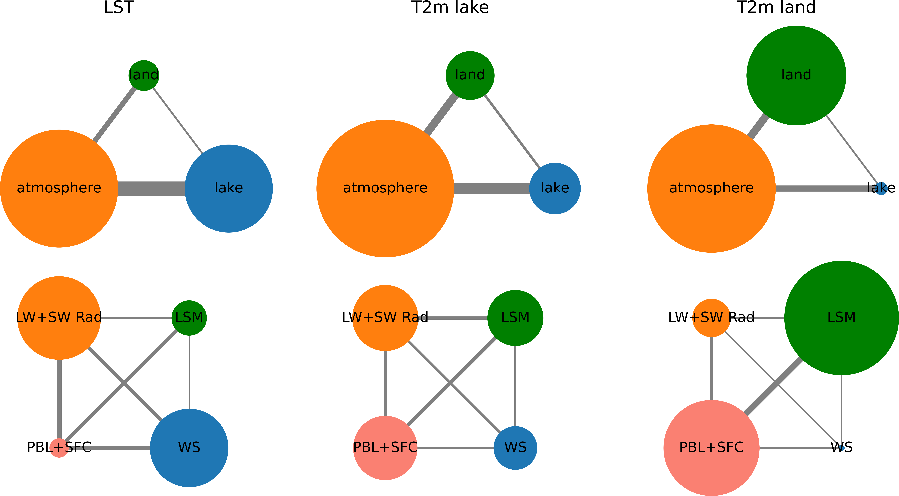

# Pringle-etal_2024_JAMES

  

**Coupled Lake-Atmosphere-Land Physics Uncertainties in a Great Lakes Regional Climate Model**

William Pringle1\*, [COMPASS-GLM Team 1](https://compass.pnnl.gov/GLM/Team)1,2,3, and Khachik Sargsyan4

1  Environmental Science Division, Argonne National Laboratory, Lemont, IL, USA
2  Department of Civil, Environmental and Geospatial Engineering, Michigan Technological University, Houghton, MI, USA
3  Pacific Northwest National Laboratory, Richland, WA, USA
4  Sandia National Laboratories, Livermore, CA, USA

\* corresponding author:  wpringle@anl.gov

## Abstract
This study develops a surrogate-based method to assess the uncertainty within a convective permitting integrated modeling system of the Great Lakes region, arising from interacting physics parameterizations across the lake, atmosphere, and land surface. Perturbed physics ensembles of the model during the 2018 summer are used to train a neural network surrogate model to predict lake surface temperature (LST) and near-surface air temperature (T2m). Average physics uncertainties are determined to be 1.5&deg;C for LST and T2m over land, and 1.9&deg;C for T2m over lake, but these have significant spatiotemporal variations. We find that atmospheric physics parameterizations alone are the dominant sources of uncertainty (45-53\%), while lake and land parameterizations account for 33\% and 38\% of the uncertainty of LST and T2m over land respectively. Interactions of atmosphere physics parameterizations with those of the land and lake contribute to an additional 13-17\% of the total variance. LST and T2m over the lake are more uncertain in the deeper northern lakes, particularly during the rapid warming phase that occurs in late spring/early summer. The LST uncertainty increases with sensitivity to the lake model's surface wind stress scheme. T2m over land is more uncertain over forested areas in the north, where it is most sensitive to the land surface model, than the more agricultural land in the south, where it is most sensitive to the atmospheric planetary boundary and surface layer scheme. Uncertainty also increases in the southwest during multiday temperature declines with higher sensitivity to the land surface model. 

## Journal reference
Pringle, W. J., Huang, C., Xue, P., Wang, J., Sargsyan K., Kayastha, M., Chakraborty, T. C., Yang, Z., Qian Y., Hetland, R. D. (2024). Coupled Lake-Atmosphere-Land Physics Uncertainties in a Great Lakes Regional Climate Model. *Journal of Advances in Modeling Earth Systems*, [10.1029/2024MS004337](http://dx.doi.org/10.1029/2024MS004337)

## Code reference
Pringle W. J. (2024, September 30). COMPASS-DOE/GreatLakes_CoupledModel_Uncertainty (Version v0.2). [Zenodo](https://doi.org/10.5281/zenodo.10806950).

## Data reference
Pringle W. J. (2024, September 30). Great Lakes WRF-FVCOM model ensemble outputs: Summer 2018 daily LST and T2m (Version v0.2) [Dataset]. [Zenodo](http://doi.org/10.5281/zenodo.10806628)

## Contributing modeling software
| Model | Version | Author-Year | DOI |
|-------|---------|-----------------|-----|
 FVCOM | v41 | Chenfu Huang (2023a) | [Zenodo](http://doi.org/10.5281/zenodo.7574673)
 WRF | v4.2.2  | Chenfu Huang (2023b) | [Zenodo](http://doi.org/10.5281/zenodo.7574675)

## [Reproduce my experiment](workflow/README.md#reproduce-my-experiment)

## [Reproduce my analysis and figures](workflow/README.md#reproduce-my-analysis-and-figures)
